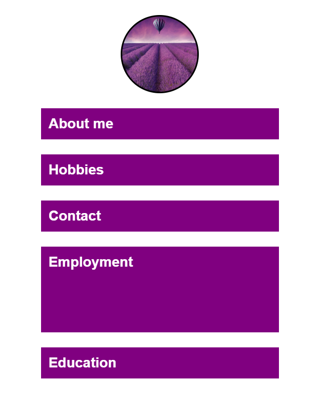
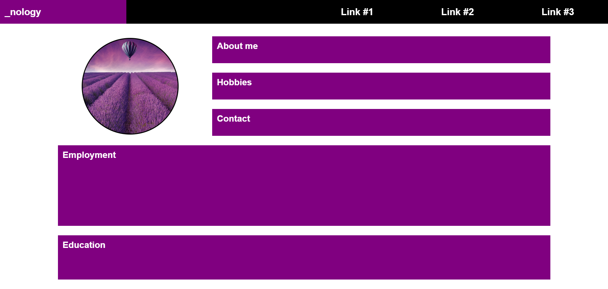
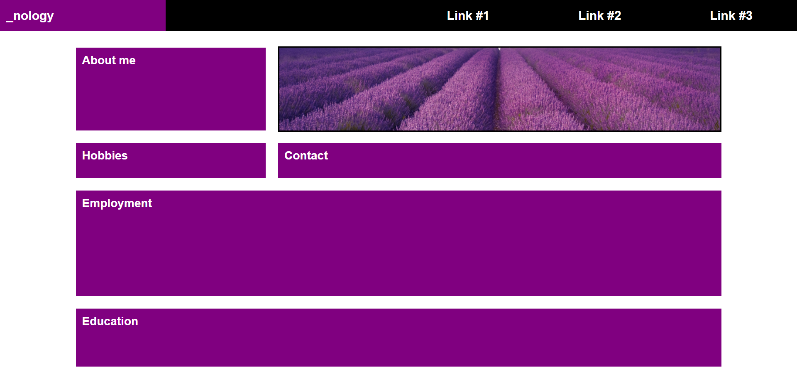

# Challenges

1. Replicate the screenshots below using CSS grid layout to create the responsiveness.
2. The first screenshot shows the mobile view and the second shows the web page above 550px.

## Additional Challenge

1. Add a second breakpoint at 768px and set the following layout to display on tablet (between 550 & 768px) using CSS grid.

