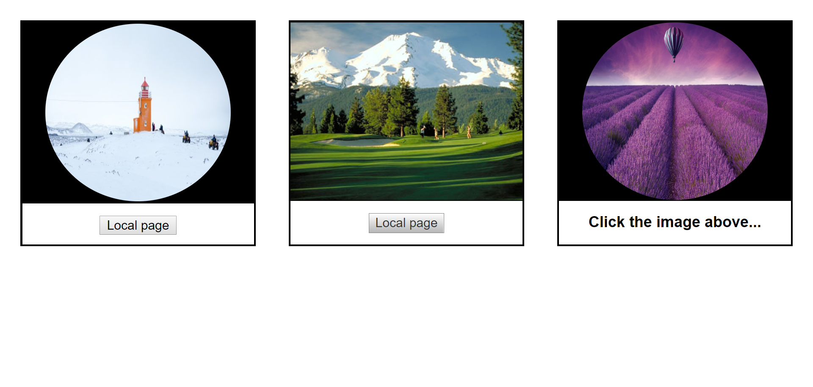

# Challenges

1. Clicking the first link will carry you further down the page to external link card (see below)
2. Clicking the second link will take you to the additional-page.html page
3. Clicking the 3rd link should open W3 schools in a new tab

## Extension Challenge

1. First card contains rounded HTML image tags + button acting as a link
2. Second card contains a div with a background image + link styled as a button
3. Third card contains a rounded HTML image tags acting as a link

